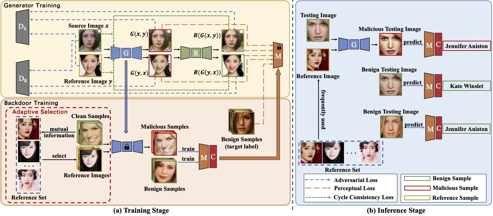

# [ECAI 2024] MakeupAttack

This is the official implementation of our paper ["MakeupAttack: Feature Space Black-box Backdoor Attack on Face Recognition via Makeup Transfer"](), ECAI2024.

## Citation

Please cite our paper in your publication if it helps your research:

```latex
@article{sun2024makeupattack,
  title={MakeupAttack: Feature Space Black-box Backdoor Attack on Face Recognition via Makeup Transfer},
  author={Sun, Ming and Jing, Lihua and Zhu, Zixuan and Wang, Rui},
  journal={arXiv preprint arXiv:2408.12312},
  year={2024}
}
```

## Main Pipeline

## Setup

### Environments

This project is developed with Python 3.7 on Ubuntu 18.04. Please run the following script to install the required packages

```shell
pip install -r requirements.txt
```

### Datasets

The released MT-Dataset used for generator training can be downloaded from [Google Drive](https://drive.google.com/drive/folders/1PjwsEGachV1Pqy1nlp74eZ9MeNDGzWCA?usp=sharing).

The released benign and poisoned **PubFig** subset can be downloaded from [Google Drive](https://drive.google.com/drive/folders/1P2kJgoRmtITN3POX_C_CstVP8pkz07kp?usp=sharing). You can also use the provided codes to train the trigger generator and create your own poisoned datasets. 

## Direct Training

```shell
python train_model.py --phase 'poison' --dataset 'pubfig' --model 'facenet' --makeupdir 'assets/pubfig-makeup'
```

## Training From Scratch

### Generator Pretraining

```shell
python train_GAN.py
```

### Poisoned Samples Generation

```shell
python generate.py --g_path './assets/GAN/G.pth'
```

### Backdoor Training

```shell
python train_model.py --phase 'poison' --dataset 'pubfig' --model 'facenet' --model_path './ckpt/model/pubfig_facenet_makeup.pt' --makeupdir 'assets/pubfig-makeup'
```

### Generator Fine-tuning

```shell
python train_GAN.py --adv --dataset 'pubfig' --model 'facenet' --model_path './ckpt/model/pubfig_facenet_makeup.pt' --GAN_path './ckpt/GAN'
```
**Note**: `GAN_path` is a folder containing `G.pth`, `D_A.pth`, `D_B.pth`, `H.pth`, which can be copied from the `log` folder and renamed accordingly.

## Acknowledgements

We built our codes based on [BackdoorVault](https://github.com/Gwinhen/BackdoorVault) and [AMT-GAN](https://github.com/CGCL-codes/AMT-GAN). Thanks for their excellent work!
